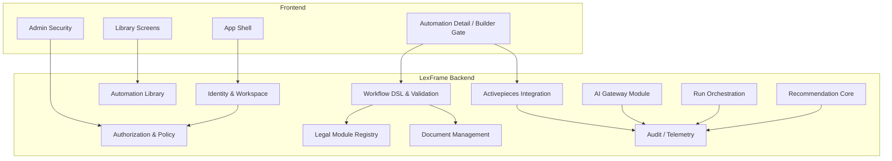

# C4 Container

```mermaid
flowchart TD
    subgraph frontend["Frontend"]
      shell["App Shell"]
      library["Library Screens"]
      automation["Automation Detail / Builder Gate"]
      security["Admin Security"]
    end

    subgraph backend["LexFrame Backend"]
      identity["Identity & Workspace"]
      authorization["Authorization & Policy"]
      modules["Legal Module Registry"]
      librarySvc["Automation Library"]
      workflow["Workflow DSL & Validation"]
      apint["Activepieces Integration"]
      aigw["AI Gateway Module"]
      docs["Document Management"]
      runs["Run Orchestration"]
      recs["Recommendation Core"]
      audit["Audit / Telemetry"]
    end

    shell --> identity
    library --> librarySvc
    automation --> workflow
    automation --> apint
    security --> authorization
    identity --> authorization
    workflow --> modules
    workflow --> docs
    apint --> audit
    aigw --> audit
    runs --> audit
    recs --> audit
```

