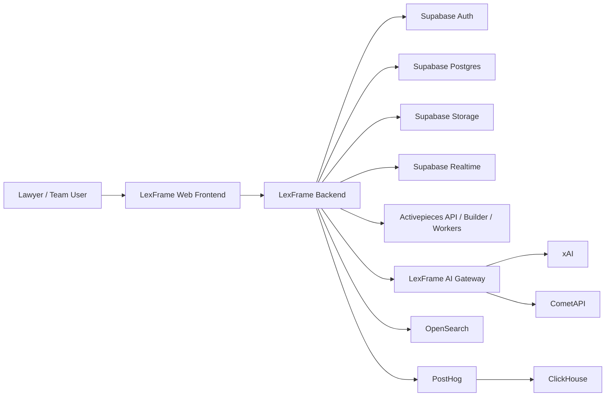

# C4 Context

## Notes

- Frontend talks to backend for every privileged decision.
- Activepieces is outside the product core and receives only constrained runtime context.
- Analytics and search remain downstream of product events and document boundaries.

