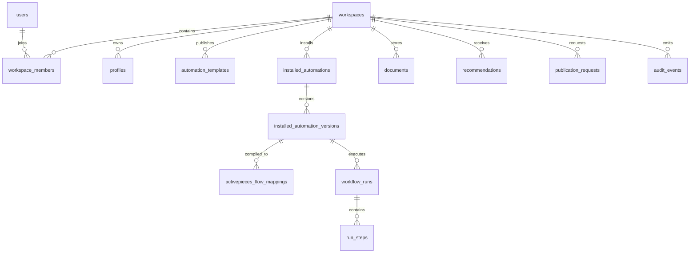

# Domain Model

## Notes

- Profiles are relational first. JSONB is reserved for versioned metadata and schemas.
- Installed automation version is the bridge between product contract and runtime compilation.
- Recommendation remains separate from installed automation until user acceptance.

