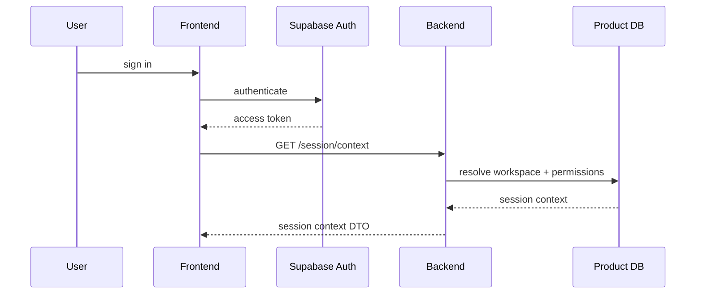
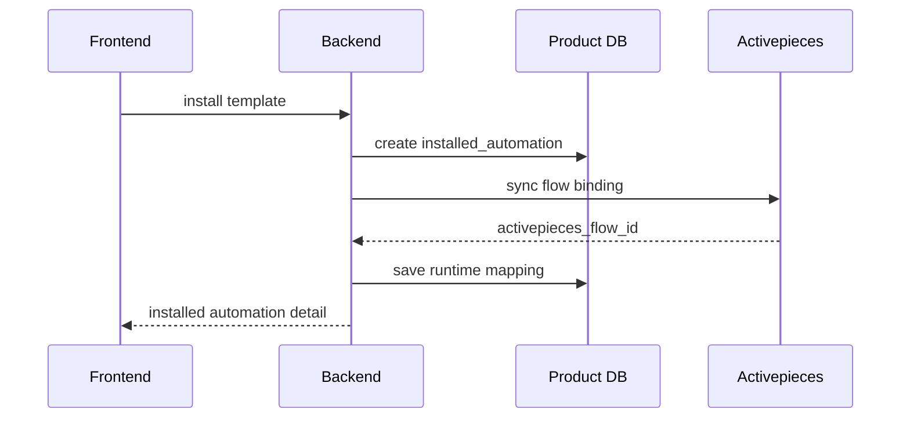
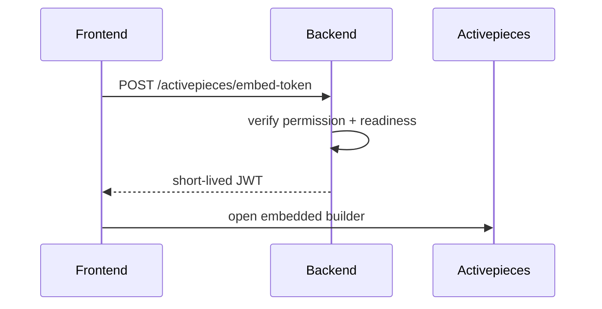
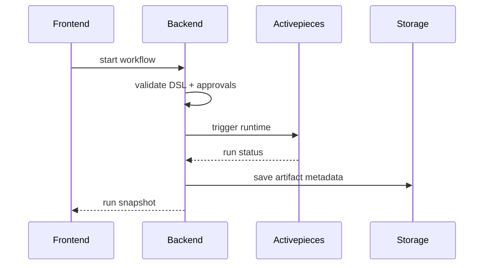

# Sequence Flows

## Login To Session Context

```mermaid
sequenceDiagram
    participant U as User
    participant FE as Frontend
    participant SA as Supabase Auth
    participant BE as Backend
    participant DB as Product DB
    U->>FE: sign in
    FE->>SA: authenticate
    SA-->>FE: access token
    FE->>BE: GET /session/context
    BE->>DB: resolve workspace + permissions
    DB-->>BE: session context
    BE-->>FE: session context DTO
```

## Install Template To Runtime Binding

```mermaid
sequenceDiagram
    participant FE as Frontend
    participant BE as Backend
    participant DB as Product DB
    participant AP as Activepieces
    FE->>BE: install template
    BE->>DB: create installed_automation
    BE->>AP: sync flow binding
    AP-->>BE: activepieces_flow_id
    BE->>DB: save runtime mapping
    BE-->>FE: installed automation detail
```

## Builder Access

```mermaid
sequenceDiagram
    participant FE as Frontend
    participant BE as Backend
    participant AP as Activepieces
    FE->>BE: POST /activepieces/embed-token
    BE->>BE: verify permission + readiness
    BE-->>FE: short-lived JWT
    FE->>AP: open embedded builder
```

## Run Workflow And Artifact Flow

```mermaid
sequenceDiagram
    participant FE as Frontend
    participant BE as Backend
    participant AP as Activepieces
    participant ST as Storage
    FE->>BE: start workflow
    BE->>BE: validate DSL + approvals
    BE->>AP: trigger runtime
    AP-->>BE: run status
    BE->>ST: save artifact metadata
    BE-->>FE: run snapshot
```

