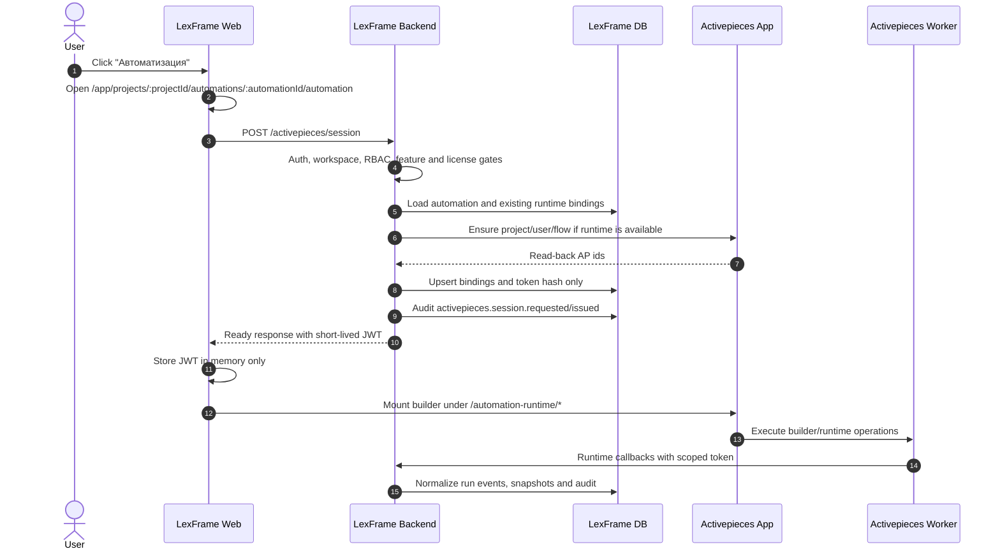

# Stage 17.2 Sequence Diagram

## Failure Branches

- Workspace/RBAC failure returns a LexFrame permission error; AP is never
  opened.
- License/provisioning gate unresolved returns structured unavailable.
- AP unavailable returns `ACTIVEPIECES_RUNTIME_UNAVAILABLE`; frontend shows
  LexFrame unavailable state, not AP login.
- Token expiry triggers a fresh backend session request; frontend never redirects
  to AP auth pages.
